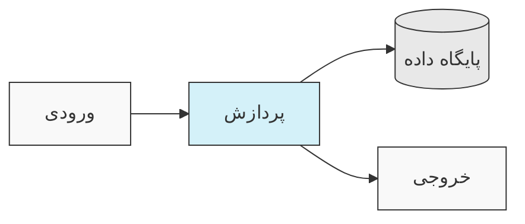
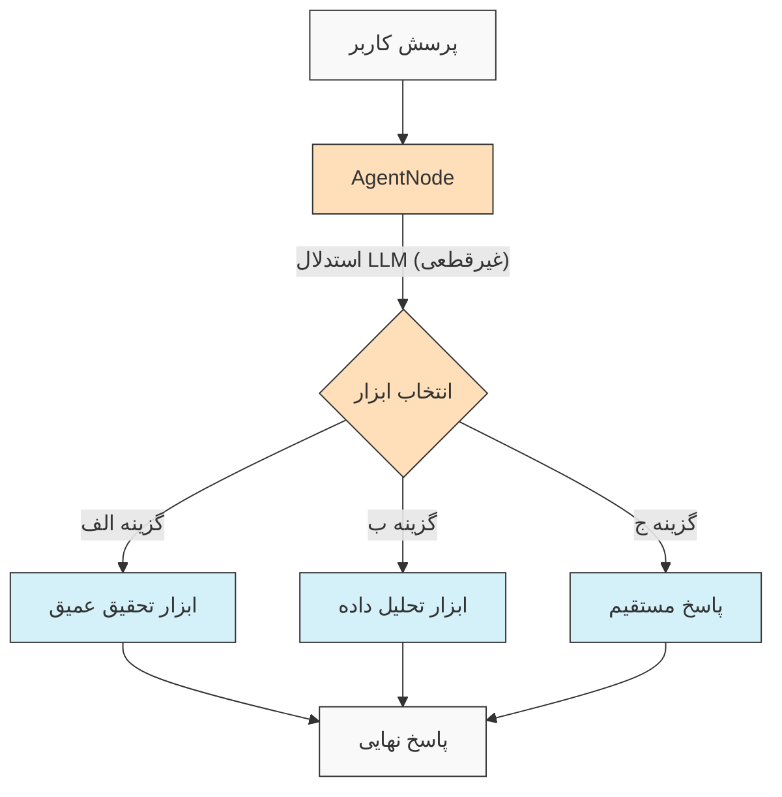
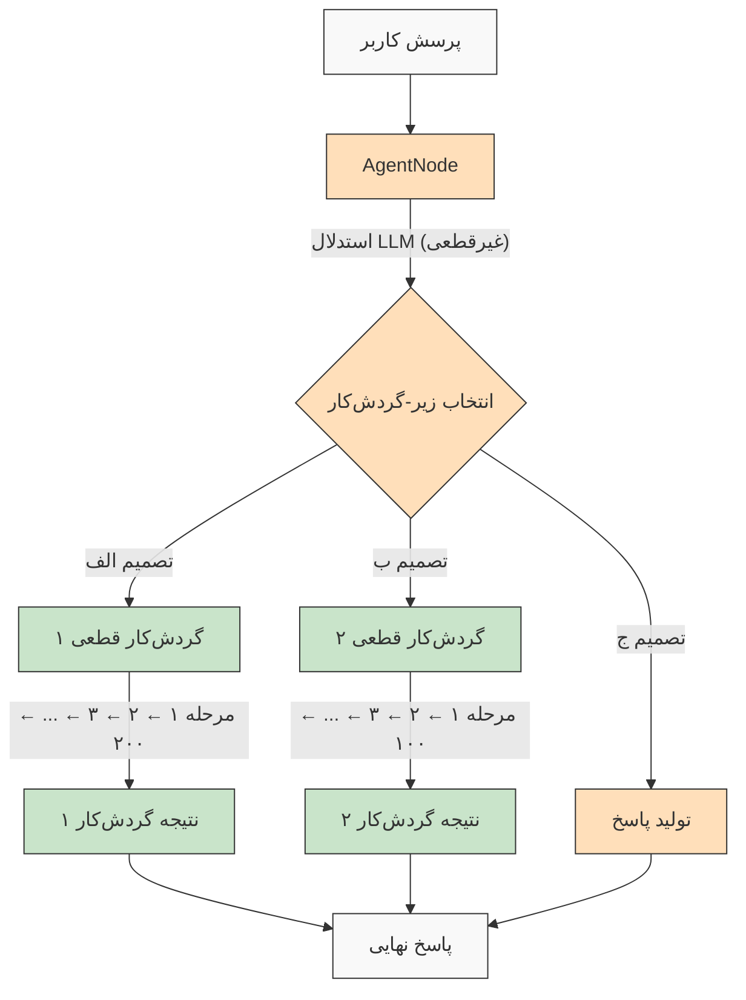

<p align="center">
  
</p>

<h1 align="left">هر چیزی را با عامل‌های هوش مصنوعی بسازید</h1>


[](https://github.com/agentdock/agentdock/stargazers)
[](https://github.com/AgentDock/AgentDock/blob/main/LICENSE)
[](https://github.com/AgentDock/AgentDock/releases)
[](https://hub.agentdock.ai/docs)
[](https://discord.gg/fDYFFmwuRA)
[](https://agentdock.ai)
[](https://x.com/agentdock)


AgentDock یک چارچوب برای ساخت عامل‌های هوش مصنوعی (AI) پیچیده است که وظایف دشوار را با **قطعیت قابل تنظیم** انجام می‌دهند. این چارچوب شامل دو جزء اصلی است:

1.  **AgentDock Core**: یک چارچوب متن‌باز و اولویت-بک‌اند برای ساخت و استقرار عامل‌های هوش مصنوعی. این چارچوب طوری طراحی شده که *مستقل از فریمورک* و *مستقل از ارائه‌دهنده* باشد و به شما کنترل کامل بر پیاده‌سازی عامل خود را می‌دهد.

2.  **کلاینت متن‌باز (Open Source Client)**: یک اپلیکیشن کامل Next.js که به عنوان یک پیاده‌سازی مرجع و مصرف‌کننده چارچوب AgentDock Core عمل می‌کند. می‌توانید آن را در [https://hub.agentdock.ai](https://hub.agentdock.ai) مشاهده کنید.

AgentDock با TypeScript ساخته شده و بر *سادگی*، *توسعه‌پذیری* و ***قطعیت قابل تنظیم*** تأکید دارد - که آن را برای ساخت سیستم‌های هوش مصنوعی قابل اعتماد و پیش‌بینی‌پذیر که می‌توانند با حداقل نظارت کار کنند، ایده‌آل می‌سازد.

## دموها (Demos)

**[دکتر گرگوری هاوس (Dr. Gregory House)](https://github.com/AgentDock/AgentDock/tree/main/agents/dr-house):** یک نیروگاه استدلال تشخیصی که ابزارهای **`search`** (جستجو)، **`deep_research`** (تحقیق عمیق) و **`pubmed`** را در یک گردش‌کار چندمرحله‌ای هماهنگ می‌کند تا با استفاده از تکنیک‌های تحقیق روشمند که با متخصصان تشخیص رقابت می‌کند، موارد پزشکی پیچیده را حل کند.

https://github.com/user-attachments/assets/50c766dc-fc65-481c-aad2-9a71169c7b28

</br>

**[استدلالگر شناختی (Cognitive Reasoner)](https://github.com/AgentDock/AgentDock/tree/main/agents/cognitive-reasoner):** موتور استدلال چندمرحله‌ای که هفت ابزار شناختی تخصصی (**`search`** (جستجو)، **`think`** (تفکر)، **`reflect`** (تأمل)، **`compare`** (مقایسه)، **`critique`** (نقد)، **`brainstorm`** (طوفان فکری)، **`debate`** (بحث)) را در گردش‌کارهای قابل تنظیم هماهنگ می‌کند تا به طور سیستماتیک مشکلات پیچیده را با الگوهای استدلالی شبیه به انسان تجزیه و تحلیل و حل کند.

https://github.com/user-attachments/assets/279a4e48-a980-4f83-becb-5e039fe10c56

</br>

**[مربی تاریخ (History Mentor)](https://github.com/AgentDock/AgentDock/tree/main/agents/history-mentor):** عامل آموزشی همه‌جانبه که دانش تاریخی برداری‌شده را با قابلیت‌های **`search`** (جستجو) و رندر پویای نمودارهای Mermaid ترکیب می‌کند تا تجربیات یادگیری معتبری ایجاد کند که روابط و خطوط زمانی پیچیده تاریخی را در صورت تقاضا به تصویر می‌کشد.

https://github.com/user-attachments/assets/56e80a15-eac3-452b-aa8b-efe7b7f3360c

</br>

**[کالری ویژن (Calorie Vision)](https://github.com/AgentDock/AgentDock/tree/main/agents/calorie-vision):** سیستم تحلیل تغذیه‌ای مبتنی بر بینایی که بینایی کامپیوتر را با استخراج داده‌های ساختاریافته ترکیب می‌کند تا تجزیه و تحلیل دقیق ماکرو و میکرو مواد مغذی را از تصاویر غذا ارائه دهد، مانند یک متخصص تغذیه که می‌تواند فوراً ترکیب وعده غذایی را بدون نیاز به ورودی دستی تعیین کند.

https://github.com/user-attachments/assets/6b4e71cf-accc-4c18-bb42-7bc5ad2f37e4

## 🌐 ترجمه‌های README

[Français](./docs/i18n/french/README.md) • [日本語](./docs/i18n/japanese/README.md) • [한국어](./docs/i18n/korean/README.md) • [中文](./docs/i18n/chinese/README.md) • [Español](./docs/i18n/spanish/README.md) • [Deutsch](./docs/i18n/deutsch/README.md) • [Italiano](./docs/i18n/italian/README.md) • [Nederlands](./docs/i18n/dutch/README.md) • [Polski](./docs/i18n/polish/README.md) • [Türkçe](./docs/i18n/turkish/README.md) • [Українська](./docs/i18n/ukrainian/README.md) • [Ελληνικά](./docs/i18n/greek/README.md) • [Русский](./docs/i18n/russian/README.md) • [العربية](./docs/i18n/arabic/README.md) • **فارسی (Farsi)**

## 🧠 اصول طراحی

AgentDock بر اساس این اصول اصلی ساخته شده است:

-   **سادگی اولویت دارد (Simplicity First)**: حداقل کد لازم برای ایجاد عامل‌های کاربردی
-   **معماری مبتنی بر گره (Node-Based Architecture)**: تمام قابلیت‌ها به عنوان گره پیاده‌سازی می‌شوند
-   **ابزارها به عنوان گره‌های تخصصی (Tools as Specialized Nodes)**: ابزارها سیستم گره را برای قابلیت‌های عامل گسترش می‌دهند
-   **قطعیت قابل تنظیم (Configurable Determinism)**: کنترل پیش‌بینی‌پذیری رفتار عامل
-   **ایمنی نوع (Type Safety)**: انواع جامع TypeScript در سراسر پروژه

### قطعیت قابل تنظیم (Configurable Determinism)

***قطعیت قابل تنظیم*** سنگ بنای فلسفه طراحی AgentDock است که به شما امکان می‌دهد تا قابلیت‌های خلاقانه هوش مصنوعی را با رفتار قابل پیش‌بینی سیستم متعادل کنید:

-   AgentNodeها ذاتاً غیرقطعی هستند زیرا LLMها ممکن است هر بار پاسخ‌های متفاوتی تولید کنند
-   گردش‌کارها می‌توانند از طریق *مسیرهای اجرای ابزار تعریف‌شده* قطعی‌تر شوند
-   توسعه‌دهندگان می‌توانند **سطح قطعیت را کنترل کنند** با پیکربندی اینکه کدام بخش‌های سیستم از استنتاج LLM استفاده می‌کنند
-   حتی با وجود اجزای LLM، رفتار کلی سیستم از طریق تعاملات ساختاریافته ابزار **قابل پیش‌بینی** باقی می‌ماند
-   این رویکرد متعادل هم *خلاقیت* و هم **قابلیت اطمینان** را در برنامه‌های هوش مصنوعی شما ممکن می‌سازد

#### گردش‌کارهای قطعی (Deterministic Workflows)

AgentDock به طور کامل از گردش‌کارهای قطعی که با آن‌ها از سازندگان گردش‌کار معمولی آشنا هستید، پشتیبانی می‌کند. تمام مسیرهای اجرایی قابل پیش‌بینی و نتایج قابل اعتمادی که انتظار دارید، با یا بدون استنتاج LLM در دسترس هستند:



#### رفتار عامل غیرقطعی (Non-Deterministic Agent Behavior)

با AgentDock، می‌توانید زمانی که به سازگاری بیشتری نیاز دارید، از AgentNodeها با LLMها نیز استفاده کنید. خروجی‌های خلاقانه ممکن است بسته به نیاز شما متفاوت باشند، در حالی که الگوهای تعامل ساختاریافته حفظ می‌شوند:



#### عامل‌های غیرقطعی با زیر-گردش‌کارهای قطعی (Non-Deterministic Agents with Deterministic Sub-Workflows)

AgentDock ***بهترین‌های هر دو دنیا*** را با ترکیب هوش عامل غیرقطعی با اجرای گردش‌کار قطعی به شما می‌دهد:



این رویکرد، گردش‌کارهای پیچیده چندمرحله‌ای (که به طور بالقوه شامل صدها مرحله قطعی پیاده‌سازی شده در ابزارها یا به عنوان توالی گره‌های متصل هستند) را قادر می‌سازد تا توسط تصمیمات هوشمند عامل فراخوانی شوند. هر گردش‌کار به طور قابل پیش‌بینی اجرا می‌شود، علی‌رغم اینکه توسط استدلال عامل غیرقطعی فعال شده است.

برای گردش‌کارهای پیشرفته‌تر عامل هوش مصنوعی و خطوط لوله پردازش چندمرحله‌ای، ما در حال ساخت [AgentDock Pro](docs/agentdock-pro.md) هستیم - یک پلتفرم قدرتمند برای ایجاد، تجسم و اجرای سیستم‌های عامل پیچیده.

#### خلاصه در مورد قطعیت قابل تنظیم (TL;DR on Configurable Determinism)

آن را مانند رانندگی در نظر بگیرید. گاهی اوقات به خلاقیت هوش مصنوعی نیاز دارید (مانند مسیریابی در خیابان‌های شهر - غیرقطعی)، و گاهی اوقات به فرآیندهای قابل اعتماد و گام به گام نیاز دارید (مانند دنبال کردن علائم بزرگراه - قطعی). AgentDock به شما امکان می‌دهد سیستم‌هایی بسازید که از *هر دو* استفاده می‌کنند و رویکرد مناسب را برای هر بخش از یک کار انتخاب می‌کنند. شما هوش مصنوعی *و* نتایج قابل پیش‌بینی را در جایی که لازم است دریافت می‌کنید.


## 🏗️ معماری هسته (Core Architecture)

این چارچوب حول یک سیستم قدرتمند و ماژولار مبتنی بر گره ساخته شده است که به عنوان پایه و اساس تمام عملکردهای عامل عمل می‌کند. این معماری از انواع گره‌های متمایز به عنوان بلوک‌های سازنده استفاده می‌کند:

-   **`BaseNode`**: کلاس بنیادی که رابط و قابلیت‌های اصلی را برای همه گره‌ها برقرار می‌کند.
-   **`AgentNode`**: یک گره هسته تخصصی که تعاملات LLM، استفاده از ابزار و منطق عامل را هماهنگ می‌کند.
-   **ابزارها و گره‌های سفارشی (Tools & Custom Nodes)**: توسعه‌دهندگان قابلیت‌های عامل و منطق سفارشی را به عنوان گره‌هایی که `BaseNode` را گسترش می‌دهند، پیاده‌سازی می‌کنند.

این گره‌ها از طریق رجیستری‌های مدیریت شده با هم تعامل دارند و می‌توانند به هم متصل شوند (با استفاده از پورت‌های معماری هسته و گذرگاه پیام بالقوه) تا رفتارها و گردش‌کارهای عامل پیچیده، قابل تنظیم و به طور بالقوه قطعی را امکان‌پذیر سازند.

برای توضیح دقیق اجزا و قابلیت‌های سیستم گره، لطفاً به [مستندات سیستم گره](docs/nodes/README.md) مراجعه کنید.

## 🚀 شروع به کار (Getting Started)

برای راهنمای جامع، به [راهنمای شروع به کار](docs/getting-started.md) مراجعه کنید.

### نیازمندی‌ها

*   Node.js ≥ 20.11.0 (LTS)
*   pnpm ≥ 9.15.0 (الزامی)
*   کلیدهای API برای ارائه‌دهندگان LLM (مانند Anthropic, OpenAI و غیره)

### نصب

1.  **کلون کردن مخزن**:

    ```bash
    git clone https://github.com/AgentDock/AgentDock.git
    cd AgentDock
    ```

2.  **نصب pnpm**:

    ```bash
    corepack enable
    corepack prepare pnpm@latest --activate
    ```

3.  **نصب وابستگی‌ها**:

    ```bash
    pnpm install
    ```

    برای نصب مجدد تمیز (زمانی که نیاز به بازسازی کامل دارید):
    ```bash
    pnpm run clean-install
    ```
    این اسکریپت تمام `node_modules`، فایل‌های قفل را حذف کرده و وابستگی‌ها را به درستی دوباره نصب می‌کند.

4.  **پیکربندی محیط**:

    یک فایل محیط (`.env` یا `.env.local`) بر اساس `.env.example` ایجاد کنید:

    ```bash
    # گزینه ۱: ایجاد .env.local
    cp .env.example .env.local

    # گزینه ۲: ایجاد .env
    cp .env.example .env
    ```

    سپس کلیدهای API خود را به فایل محیط اضافه کنید.

5.  **راه‌اندازی سرور توسعه**:

    ```bash
    pnpm dev
    ```

### قابلیت‌های پیشرفته

| قابلیت                   | توضیحات                                                                   | مستندات                                                   |
|--------------------------|---------------------------------------------------------------------------|-----------------------------------------------------------|
| **مدیریت نشست (Session)** | مدیریت وضعیت ایزوله و با کارایی بالا برای مکالمات                         | [مستندات Session](./docs/architecture/sessions/README.md) |
| **چارچوب هماهنگ‌سازی**    | کنترل رفتار عامل و در دسترس بودن ابزار بر اساس زمینه (context)           | [مستندات Orchestration](./docs/architecture/orchestration/README.md) |
| **انتزاع ذخیره‌سازی**     | سیستم ذخیره‌سازی انعطاف‌پذیر با ارائه‌دهندگان قابل اتصال برای KV، Vector و Secure | [مستندات Storage](./docs/storage/README.md)              |

سیستم ذخیره‌سازی در حال حاضر با ذخیره‌سازی کلید-مقدار (ارائه‌دهندگان Memory، Redis، Vercel KV) و ذخیره‌سازی امن سمت کلاینت در حال تکامل است، در حالی که ذخیره‌سازی برداری (Vector) و بک‌اند‌های اضافی در دست توسعه هستند.

## 📕 مستندات (Documentation)

مستندات چارچوب AgentDock در [hub.agentdock.ai/docs](https://hub.agentdock.ai/docs) و در پوشه `/docs/` این مخزن موجود است. مستندات شامل:

-   راهنماهای شروع به کار
-   مراجع API
-   آموزش‌های ایجاد گره
-   مثال‌های ادغام

## 📂 ساختار مخزن (Repository Structure)

این مخزن شامل:

1.  **AgentDock Core**: چارچوب اصلی واقع در `agentdock-core/`
2.  **کلاینت متن‌باز (Open Source Client)**: یک پیاده‌سازی مرجع کامل ساخته شده با Next.js، که به عنوان مصرف‌کننده چارچوب AgentDock Core عمل می‌کند.
3.  **عامل‌های نمونه (Example Agents)**: پیکربندی‌های عامل آماده برای استفاده در پوشه `agents/`

می‌توانید از AgentDock Core به طور مستقل در برنامه‌های خود استفاده کنید، یا از این مخزن به عنوان نقطه شروع برای ساخت برنامه‌های مبتنی بر عامل خود استفاده کنید.

## 📝 قالب‌های عامل (Agent Templates)

AgentDock شامل چندین قالب عامل از پیش پیکربندی شده است. آن‌ها را در پوشه `agents/` کاوش کنید یا [مستندات قالب‌های عامل](docs/agent-templates.md) را برای جزئیات پیکربندی بخوانید.

## 🔧 پیاده‌سازی‌های نمونه (Example Implementations)

پیاده‌سازی‌های نمونه، موارد استفاده تخصصی و قابلیت‌های پیشرفته را نشان می‌دهند:

| پیاده‌سازی                       | توضیحات                                                                   | وضعیت     |
|---------------------------------|---------------------------------------------------------------------------|-----------|
| **عامل هماهنگ‌شده (Orchestrated)** | عامل نمونه با استفاده از هماهنگ‌سازی برای تطبیق رفتار بر اساس زمینه (context) | موجود    |
| **استدلالگر شناختی**            | حل مشکلات پیچیده با استفاده از استدلال ساختاریافته و ابزارهای شناختی       | موجود    |
| **برنامه‌ریز عامل (Agent Planner)** | عامل تخصصی برای طراحی و پیاده‌سازی سایر عامل‌های هوش مصنوعی             | موجود    |
| [**زمین بازی کد (Code Playground)**](docs/roadmap/code-playground.md) | تولید و اجرای کد در محیط ایزوله با قابلیت‌های تجسم غنی              | برنامه‌ریزی شده |
| [**عامل هوش مصنوعی عمومی (Generalist)**](docs/roadmap/generalist-agent.md) | عاملی شبیه Manus که می‌تواند از مرورگر استفاده کرده و وظایف پیچیده را اجرا کند | برنامه‌ریزی شده |


## 🔐 جزئیات پیکربندی محیط

کلاینت متن‌باز AgentDock برای عملکرد به کلیدهای API ارائه‌دهندگان LLM نیاز دارد. این موارد در یک فایل محیط (`.env` یا `.env.local`) پیکربندی می‌شوند که شما بر اساس فایل `.env.example` ارائه شده ایجاد می‌کنید.

### کلیدهای API ارائه‌دهندگان LLM

کلیدهای API ارائه‌دهنده LLM خود را اضافه کنید (حداقل یکی لازم است):

```bash
# کلیدهای API ارائه‌دهندگان LLM - حداقل یکی لازم است
ANTHROPIC_API_KEY=sk-ant-xxxxxxx  # کلید API انتروپیک
OPENAI_API_KEY=sk-xxxxxxx         # کلید API اوپن‌ای‌آی
GEMINI_API_KEY=xxxxxxx            # کلید API گوگل جمینای
DEEPSEEK_API_KEY=xxxxxxx          # کلید API دیپ‌سیک
GROQ_API_KEY=xxxxxxx              # کلید API گروک
```

### اولویت‌بندی کلید API

کلاینت متن‌باز AgentDock هنگام تعیین اینکه از کدام کلید API استفاده کند، از یک ترتیب اولویت پیروی می‌کند:

1.  **کلید API سفارشی هر عامل** (تنظیم شده از طریق تنظیمات عامل در رابط کاربری)
2.  **کلید API تنظیمات عمومی** (تنظیم شده از طریق صفحه تنظیمات در رابط کاربری)
3.  **متغیر محیطی** (از .env.local یا پلتفرم استقرار)

### کلیدهای API مختص ابزار

برخی ابزارها نیز به کلیدهای API خود نیاز دارند:

```bash
# کلیدهای API مختص ابزار
SERPER_API_KEY=                  # برای عملکرد جستجو لازم است
FIRECRAWL_API_KEY=               # برای جستجوی عمیق‌تر وب لازم است
```

برای جزئیات بیشتر در مورد پیکربندی محیط، به پیاده‌سازی در [`src/types/env.ts`](src/types/env.ts) مراجعه کنید.

### استفاده از کلیدهای API شخصی (BYOK)

AgentDock از مدل BYOK (کلید خودتان را بیاورید) پیروی می‌کند:

1.  کلیدهای API خود را در صفحه تنظیمات برنامه اضافه کنید.
2.  به طور جایگزین، کلیدها را از طریق هدرهای درخواست برای استفاده مستقیم از API ارائه دهید.
3.  کلیدها با استفاده از سیستم رمزنگاری داخلی به صورت امن ذخیره می‌شوند.
4.  هیچ کلید API در سرورهای ما به اشتراک گذاشته یا ذخیره نمی‌شود.

## 📦 مدیر بسته (Package Manager)

این پروژه *نیازمند* استفاده از `pnpm` برای مدیریت سازگار وابستگی‌ها است. `npm` و `yarn` پشتیبانی نمی‌شوند.

## 💡 چه چیزهایی می‌توانید بسازید

1.  **برنامه‌های کاربردی مبتنی بر هوش مصنوعی**
    *   چت‌بات‌های سفارشی با هر فرانت‌اندی
    *   دستیارهای هوش مصنوعی خط فرمان
    *   خطوط لوله پردازش داده خودکار
    *   ادغام با سرویس‌های بک‌اند

2.  **قابلیت‌های ادغام**
    *   هر ارائه‌دهنده هوش مصنوعی (OpenAI, Anthropic و غیره)
    *   هر چارچوب فرانت‌اند
    *   هر سرویس بک‌اند
    *   منابع داده و APIهای سفارشی

3.  **سیستم‌های اتوماسیون**
    *   گردش‌کارهای پردازش داده
    *   خطوط لوله تحلیل اسناد
    *   سیستم‌های گزارش‌دهی خودکار
    *   عامل‌های اتوماسیون وظایف

## ویژگی‌های کلیدی

| ویژگی                     | توضیحات                                                                  |
|---------------------------|--------------------------------------------------------------------------|
| 🔌 **مستقل از چارچوب (بک‌اند Node.js)** | کتابخانه اصلی با پشته‌های بک‌اند Node.js ادغام می‌شود.                |
| 🧩 **طراحی ماژولار**        | ساخت سیستم‌های پیچیده از گره‌های ساده                                    |
| 🛠️ **توسعه‌پذیر**          | ایجاد گره‌های سفارشی برای هر عملکردی                                    |
| 🔒 **امن**                | ویژگی‌های امنیتی داخلی برای کلیدهای API و داده‌ها                       |
| 🔑 **BYOK**               | از *کلیدهای API شخصی خودتان* برای ارائه‌دهندگان LLM استفاده کنید           |
| 📦 **خودمختار (Self-Contained)** | چارچوب اصلی وابستگی‌های حداقلی دارد                                   |
| ⚙️ **فراخوانی ابزار چندمرحله‌ای** | پشتیبانی از *زنجیره‌های استدلال پیچیده*                             |
| 📊 **لاگ‌گیری ساختاریافته** | بینش دقیق در مورد اجرای عامل                                            |
| 🛡️ **مدیریت خطای قوی**     | رفتار قابل پیش‌بینی و اشکال‌زدایی ساده‌تر                                |
| 📝 **اولویت با TypeScript** | ایمنی نوع و تجربه توسعه‌دهنده بهبود یافته                             |
| 🌐 **کلاینت متن‌باز**     | پیاده‌سازی مرجع کامل Next.js گنجانده شده است                           |
| 🔄 **هماهنگ‌سازی (Orchestration)** | *کنترل پویا* رفتار عامل بر اساس زمینه (context)                     |
| 💾 **مدیریت نشست (Session)** | وضعیت ایزوله برای مکالمات همزمان                                        |
| 🎮 **قطعیت قابل تنظیم**    | تعادل بین خلاقیت هوش مصنوعی و پیش‌بینی‌پذیری از طریق منطق/گردش‌کار گره. |

## 🧰 اجزاء (Components)

معماری ماژولار AgentDock بر اساس این اجزای کلیدی ساخته شده است:

*   **BaseNode**: پایه و اساس همه گره‌ها در سیستم
*   **AgentNode**: انتزاع اصلی برای عملکرد عامل
*   **ابزارها و گره‌های سفارشی**: قابلیت‌های قابل فراخوانی و منطق سفارشی پیاده‌سازی شده به عنوان گره.
*   **رجیستری گره (Node Registry)**: مدیریت ثبت و بازیابی انواع گره‌ها
*   **رجیستری ابزار (Tool Registry)**: مدیریت در دسترس بودن ابزار برای عامل‌ها
*   **CoreLLM**: رابط یکپارچه برای تعامل با ارائه‌دهندگان LLM
*   **رجیستری ارائه‌دهنده (Provider Registry)**: مدیریت پیکربندی‌های ارائه‌دهنده LLM
*   **مدیریت خطا (Error Handling)**: سیستم برای مدیریت خطاها و تضمین رفتار قابل پیش‌بینی
*   **لاگ‌گیری (Logging)**: سیستم لاگ‌گیری ساختاریافته برای نظارت و اشکال‌زدایی
*   **هماهنگ‌سازی (Orchestration)**: کنترل در دسترس بودن و رفتار ابزار بر اساس زمینه مکالمه
*   **نشست‌ها (Sessions)**: مدیریت ایزوله‌سازی وضعیت بین مکالمات همزمان

برای مستندات فنی دقیق در مورد این اجزا، به [مرور کلی معماری](docs/architecture/README.md) مراجعه کنید.


## 🗺️ نقشه راه (Roadmap)

در زیر نقشه راه توسعه ما برای AgentDock آمده است. بیشتر بهبودهای ذکر شده در اینجا مربوط به چارچوب اصلی AgentDock (`agentdock-core`) است که در حال حاضر به صورت محلی توسعه داده می‌شود و پس از رسیدن به نسخه پایدار به عنوان یک بسته NPM نسخه‌بندی شده منتشر خواهد شد. برخی از موارد نقشه راه ممکن است شامل بهبودهایی در پیاده‌سازی کلاینت متن‌باز نیز باشد.

| ویژگی                                       | توضیحات                                                                     | دسته‌بندی       |
|--------------------------------------------|-----------------------------------------------------------------------------|----------------|
| [**لایه انتزاع ذخیره‌سازی**](docs/roadmap/storage-abstraction.md) | سیستم ذخیره‌سازی انعطاف‌پذیر با ارائه‌دهندگان قابل اتصال                      | **در حال انجام** |
| [**سیستم‌های حافظه پیشرفته**](docs/roadmap/advanced-memory.md)    | مدیریت زمینه بلندمدت                                                         | **در حال انجام** |
| [**ادغام ذخیره‌سازی برداری (Vector)**](docs/roadmap/vector-storage.md) | بازیابی مبتنی بر Embedding برای اسناد و حافظه                                | **در حال انجام** |
| [**ارزیابی برای عامل‌های هوش مصنوعی**](docs/roadmap/evaluation-framework.md) | چارچوب تست و ارزیابی جامع                                                  | **در حال انجام** |
| [**ادغام پلتفرم**](docs/roadmap/platform-integration.md)       | پشتیبانی از تلگرام، واتس‌اپ و سایر پلتفرم‌های پیام‌رسانی                   | **برنامه‌ریزی شده** |
| [**همکاری چند عاملی**](docs/roadmap/multi-agent-collaboration.md) | امکان همکاری عامل‌ها با یکدیگر                                              | **برنامه‌ریزی شده** |
| [**ادغام پروتکل زمینه مدل (MCP)**](docs/roadmap/mcp-integration.md) | پشتیبانی از کشف و استفاده از ابزارهای خارجی از طریق MCP                      | **برنامه‌ریزی شده** |
| [**عامل‌های هوش مصنوعی صوتی**](docs/roadmap/voice-agents.md)      | عامل‌های هوش مصنوعی با استفاده از رابط‌های صوتی و شماره تلفن از طریق AgentNode | **برنامه‌ریزی شده** |
| [**تله‌متری و قابلیت ردیابی**](docs/roadmap/telemetry.md)       | لاگ‌گیری پیشرفته و ردیابی عملکرد                                            | **برنامه‌ریزی شده** |
| [**زمان اجرای گردش‌کار و گره‌ها**](docs/roadmap/workflow-nodes.md) | زمان اجرای هسته، انواع گره‌ها و منطق هماهنگ‌سازی برای اتوماسیون‌های پیچیده | **برنامه‌ریزی شده** |
| [**AgentDock Pro**](docs/agentdock-pro.md)                     | پلتفرم ابری جامع سازمانی برای مقیاس‌بندی عامل‌ها و گردش‌کارهای هوش مصنوعی      | **ابر (Cloud)** |
| [**سازنده عامل هوش مصنوعی با زبان طبیعی**](docs/roadmap/nl-agent-builder.md) | سازنده بصری + ساخت عامل و گردش‌کار با زبان طبیعی                         | **ابر (Cloud)** |
| [**بازارچه عامل (Agent Marketplace)**](docs/roadmap/agent-marketplace.md) | قالب‌های عامل قابل کسب درآمد                                               | **ابر (Cloud)** |

## 👥 مشارکت (Contributing)

ما از مشارکت در AgentDock استقبال می‌کنیم! لطفاً برای دستورالعمل‌های دقیق مشارکت به [CONTRIBUTING.md](CONTRIBUTING.md) مراجعه کنید.

## 📜 مجوز (License)

AgentDock تحت [مجوز MIT](LICENSE) منتشر شده است.

## ✨ هر چیزی را بسازید!

AgentDock پایه و اساس ساخت تقریباً هر برنامه کاربردی یا اتوماسیون مبتنی بر هوش مصنوعی را که می‌توانید تصور کنید، فراهم می‌کند. ما شما را تشویق می‌کنیم که چارچوب را کاوش کنید، عامل‌های نوآورانه بسازید و به جامعه کمک کنید. بیایید با هم آینده تعامل هوش مصنوعی را بسازیم!

--- END OF FILE README.fa.md ---
```